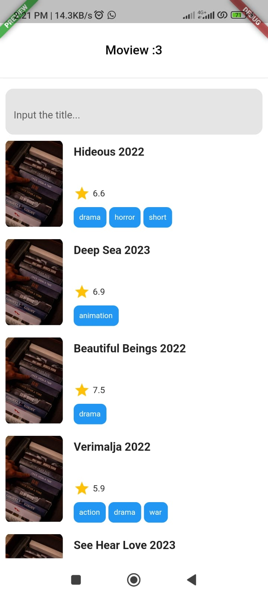
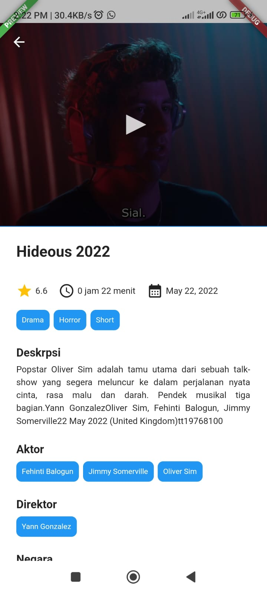
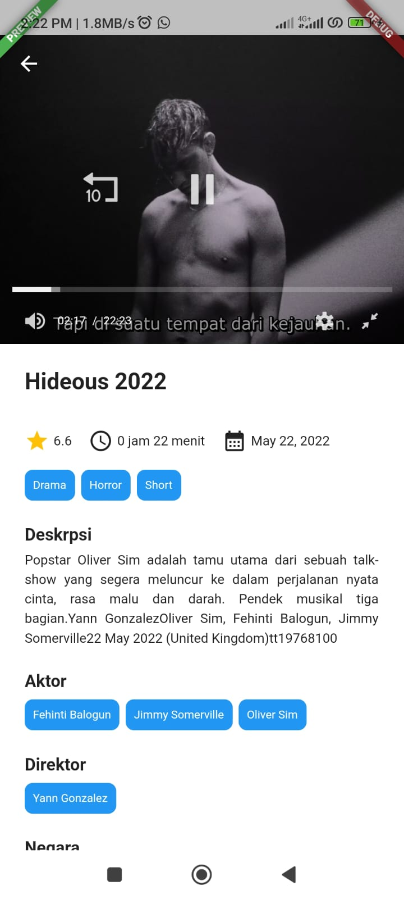

## Description

Simple flutter application to fetch API from [LK21 (Unofficial)](https://github.com/febriadj/lk21-api) using [Nexteam template](https://github.com/Nexteam-Indonesia/flutter_starter)

---

## Screenshots

---

## Tech 😅

| Technology   | Documentation                                               |
| ------------ | ----------------------------------------------------------- |
| Auto Route   | [auto_route](https://pub.dev/packages/auto_route)           |
| Dio          | [dio](https://pub.dev/packages/dio)                         |
| BLoC         | [bloc](https://pub.dev/packages/bloc)                       |
| Flutter BLoC | [flutter_bloc](https://pub.dev/packages/flutter_bloc)       |
| Get It       | [get_it](https://pub.dev/packages/get_it)                   |
| Injectable   | [injectable](https://pub.dev/packages/injectable)           |
| WebView      | [webview_flutter](https://pub.dev/packages/webview_flutter) |

---
